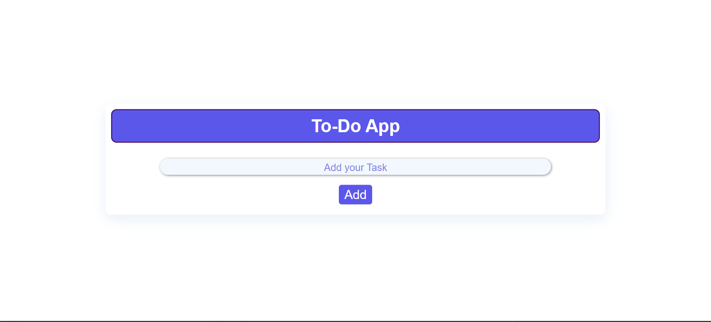
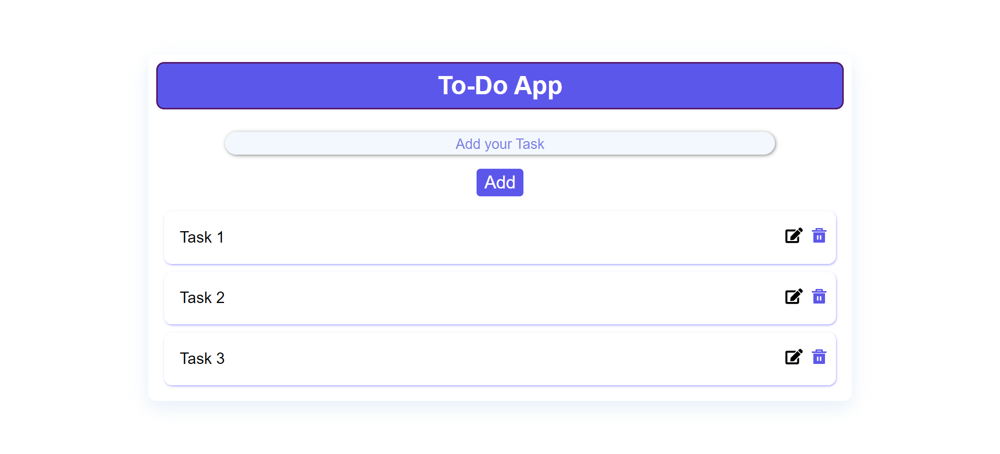
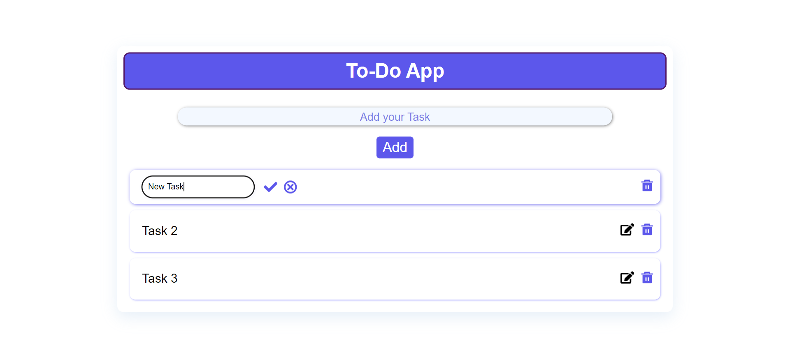
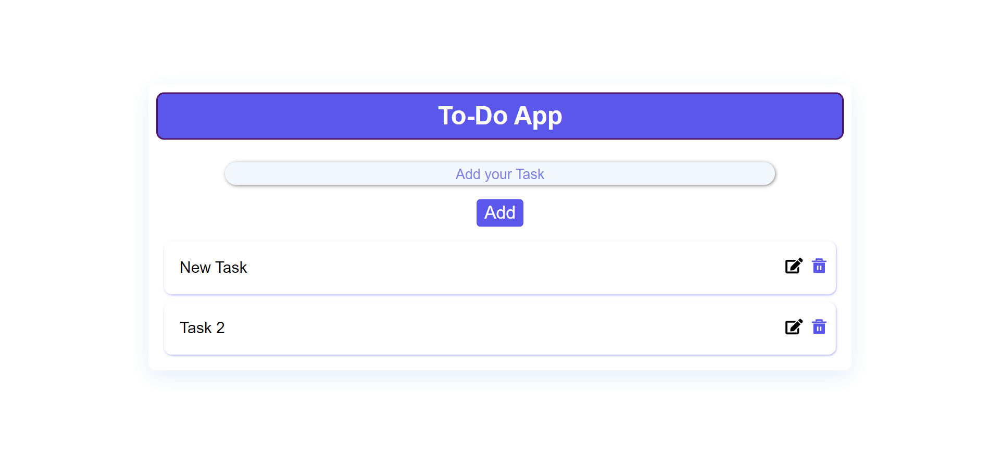

# To-Do List App

Welcome to the To-Do List App! This simple application allows you to manage your tasks efficiently. You can add, edit and delete tasks. The app is built using TypeScript and uses local storage to save and retrieve tasks.

## Features

- **Add Tasks:** Easily add new tasks to your to-do list.
- **Edit Tasks:** Modify existing tasks without changing other elements.
- **Delete Tasks:** Remove tasks from your list.
- **Persistent Storage:** Tasks are saved in local storage, so they persist even after refreshing the page.

## Screenshots

### Main Interface


### Adding a Task


### Editing a Task - Step 1


### Editing a Task - Step 2
.png)

### Deleting a Task



## Getting Started

### Prerequisites

To run this project, you need to have Node.js and npm installed. If you don't have them installed, you can download and install them from [here](https://nodejs.org/).

### Installation

1. Clone the repository:
   ```sh
   git clone https://github.com/hawetengg/To-Do-App-React.git
